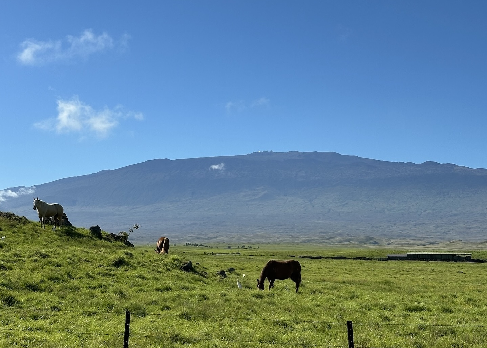
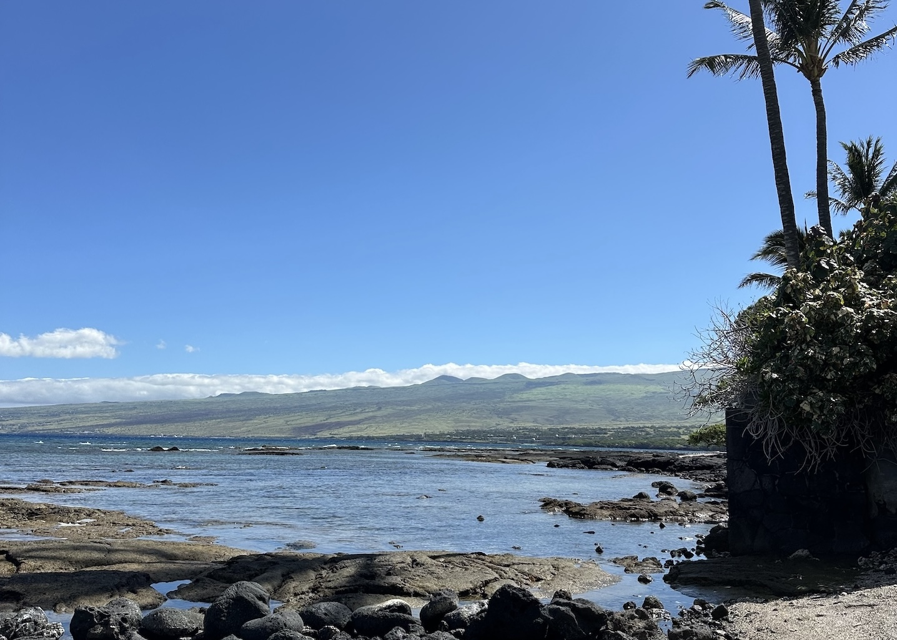
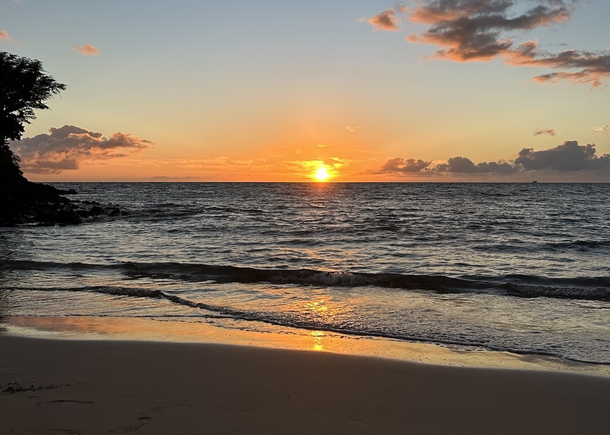
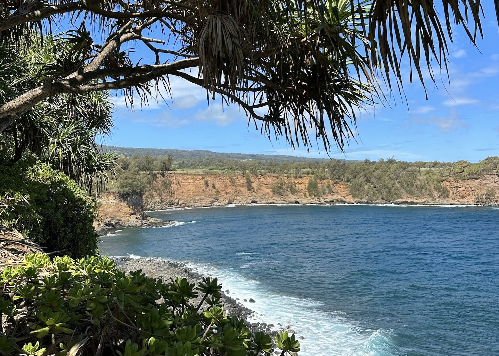
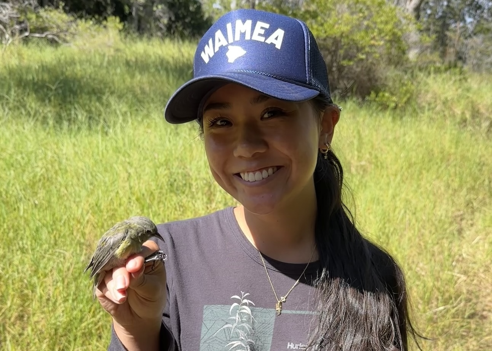
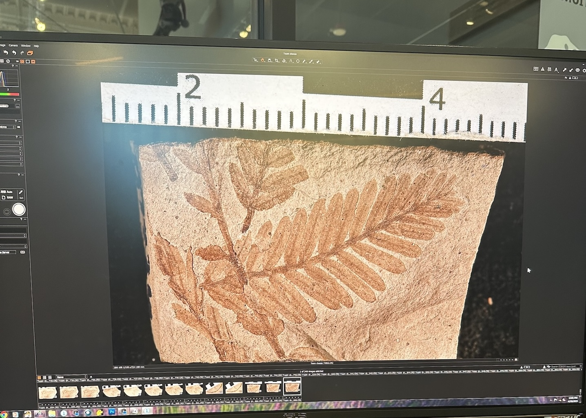
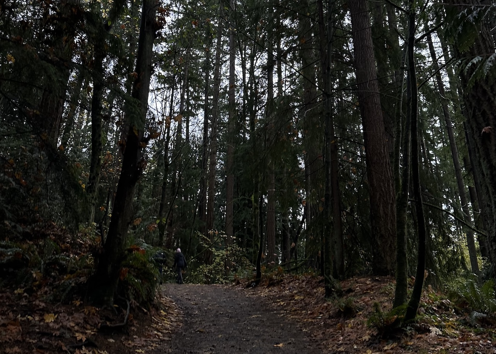
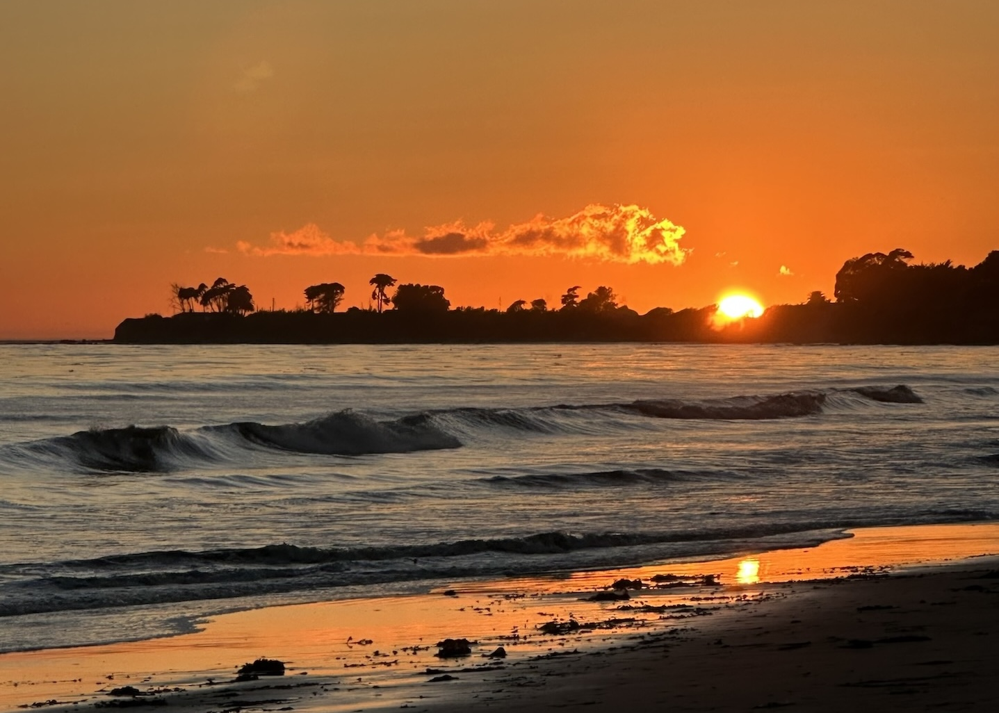

#### **My roots**

Growing up in Hawaiʻi, I was surrounded by a community and unique ecosystems that shaped my love for the environment. I spent countless hours exploring the beach and different forests on the island of Hawaiʻi, where I've found so much peace in connecting with the land. Through hula, chants, moʻolelo, and tradition, I grew to deeply appreciate the relationship Hawaiian culture has long fostered with the land.

My interest in environmental science began in seventh grade when my science class explored how climate change is affecting Hawaiʻi by simulating sea level rise, studying the decline of native plants, and examining shifting weather patterns. These topics fascinated me as much as they concerned me. That feeling deepened when I traveled with my school to Fairbanks, Alaska where we collaborated with Alaska Native students to discuss climate concerns and solutions. What I witnessed there was a completely different realm of climate impacts and it became clear to me that our *world* is changing. Though our experiences differed, I found that our communities both rely on and trust traditional ecological knowledge as a guide to sustainability and preservation. 

This only deepened my curiosity—about the way the environment functions and more about the traditional knowledge my community holds. In pursuing my Bachelorʻs degree in Environmental Science and Resource Management I was given a strong foundation in understanding of the way the environment works and the effects of climate change. Through my Quantitative Science minor, I gained skills in statistics and model building that have given me the ability to make informed decisions based on data analysis. During my academic journey, I've gained insights into traditional ecological knowledge by participating in fish ponds restoration, working in the loʻi (traditional Hawaiian wetland kalo patch), collecting native plant seeds, and tending hala groves.

From these experiences a teaching Iʻve inherited from both my community and the environment is to leave a place better than you found it. This goes beyond being conscious of my litter and environmental impact to caring for the land so that it is better for future generations. I believe that how we care for the land allows us to continue to pass down traditions and practices within our communities.

The ʻōlelo noʻeau, ***I ka wā ma mua, ka wā ma hope***, The future is found in the past, is a Hawaiian proverb that I hold close to my heart. While this proverb reminds me to honor the past, it inspires me to continue to move forward. As an environmental data scientist I am driven to combine traditional ecological knowledge with technology and data-driven tools to develop innovative solutions to the environmental challenges we face today.

#### **And more!**
 
***The meaning behind "Gigi"...***

When I was born, my older sister who at the time was only a year old could not pronounce my name, Jaslyn. So she instead gave me the nickname "Gigi", which stuck beyond our childhood. Since then there has been even more derivations of my names: "Gi", "Geeg", "Jaz" and even "Double G". Probably one of my greatest regrets is not making my GitHub username "gigiplot", a little joke other data scientist would have (hopefully) gotten a kick out of.

***The icon...***

Cherry blossoms seem to follow me wherever I go. Back home in Waimea, these trees are scattered throughout town, and the brief window when they bloom is my favorite time of year. After moving away for college, homesickness was so real — until the University of Washington's famous cherry trees finally blossomed, which felt like a reminder of home. In Japanese culture, cherry blossom season is a time of reflection on life's fleeting nature. Now, wherever I encounter them, they serve as a reminder to stay grounded, present, and intentional — in the places I go, the people I meet, and the work I do.

***The inspiration... ***

::: {style="width: 80%; margin: 0 auto;"}
::: panel-tabset

### waimea
My home town! The place I will always go back to! Nestled on southern part of the Kohala mountain and made up of unique climates, Waimea is a special place known as paniolo (cowboy) country. I love this image because it truly captures the beauty and meaning of Waimea.
{group="my-group"}

### puakō
Growing up, I spent much time wading in the tide pools with my sister, while my dad dove for fish that we would later eat for dinner! I still love exploring the tide pools here, especially when the sea turtles are basking on the lava rocks.
{group="my-group"}

### mauʻumae
Being a quick 20 minute cruise down the hill, Mauʻumae is my favorite beach on the island of Hawaiʻi.
{group="my-group"}

### nuiliʻi
I spent a day visiting Nuiliʻi in Kohala, an area of land under the care of [The Kohala Center](https://storymaps.arcgis.com/stories/157efdffecaa4271bf124e5dee227629). I was able to tend to the ulu hala (lau hala groves) of Nuiliʻi to contribute to the greater effort of replenishing lau hala in Kohala.
{group="my-group"}

### ʻamakihi
Me and a Hawaiʻi ʻAmakihi! One of my absolute favorite things to do is sitting in an ʻōhiʻa forest and listening to all the native Hawaiian forest bird sing. Since many of these beautiful little birds face many threats such as habitat loss and avian malaria, I feel incredibly lucky to have participated in several bird banding days to gain insights into the health of these populations.

{group="my-group"}

### burke
During my junior year of undergrad, I spent some time as a Plant Macrofossil Photographer for the Strömberg Paleobotany Lab at the Burke Museum of Natural History and Culture. The museum's glass-walled working labs allowed guests to see curators and scientist in action. While working under the watchful eyes of museum visitors, I was grateful to have the opportunity to show my community what research is like up close.
{group="my-group"}

### seattle
During undergrad, I spent many field trips learning about the Pacific North West forests!

{group="my-group"}

### santa barbara
I had the privilage of spending a year in Santa Barbara, to complete my Master's degree. A place that feels like home, from the sunny weather and beaches to a community that **LOVES** the outdoors.
{group="my-group"}

:::

