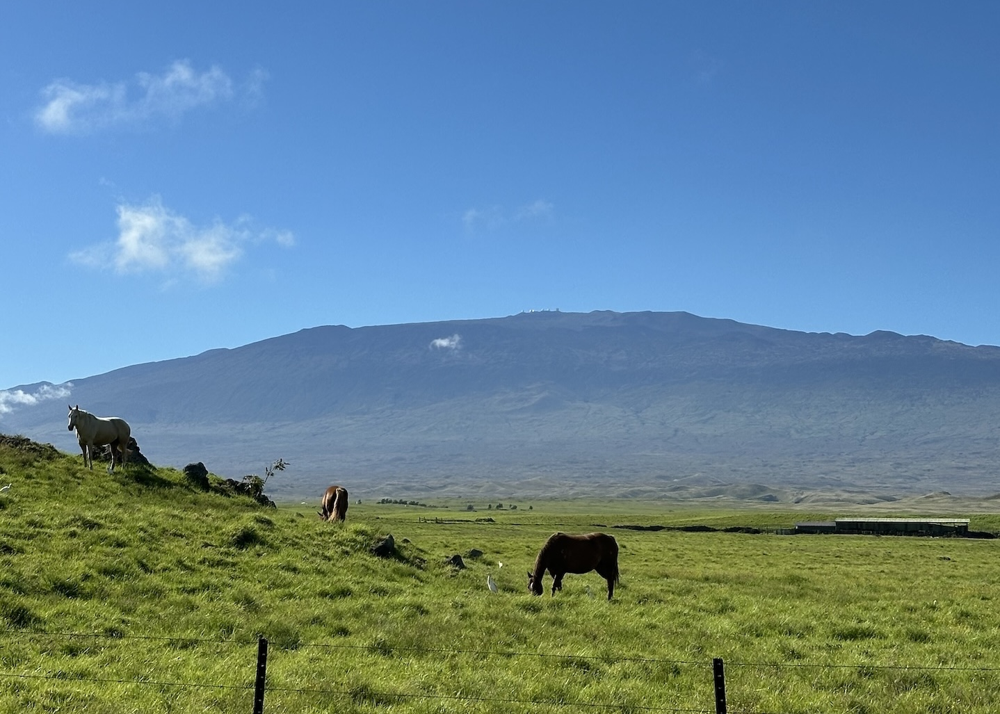
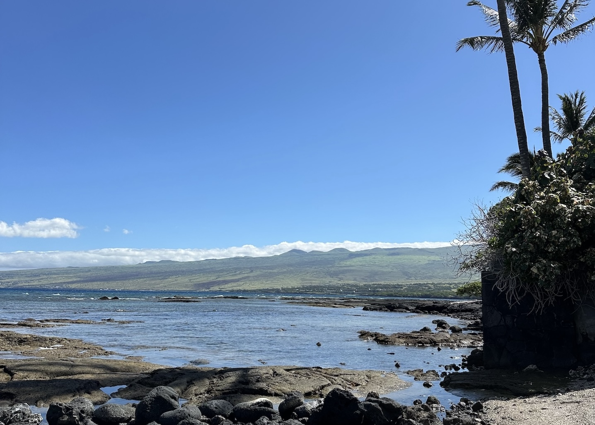
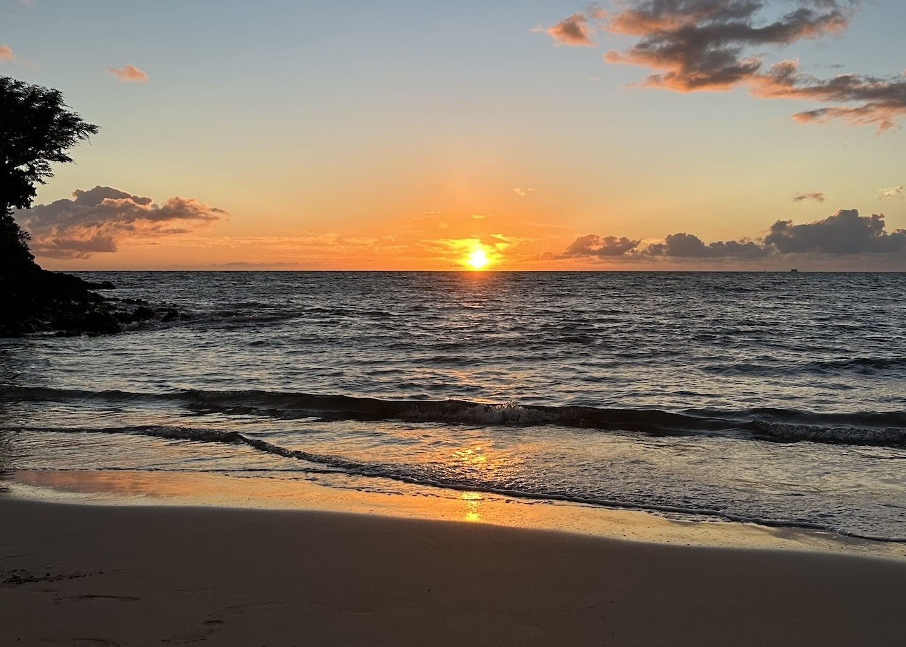
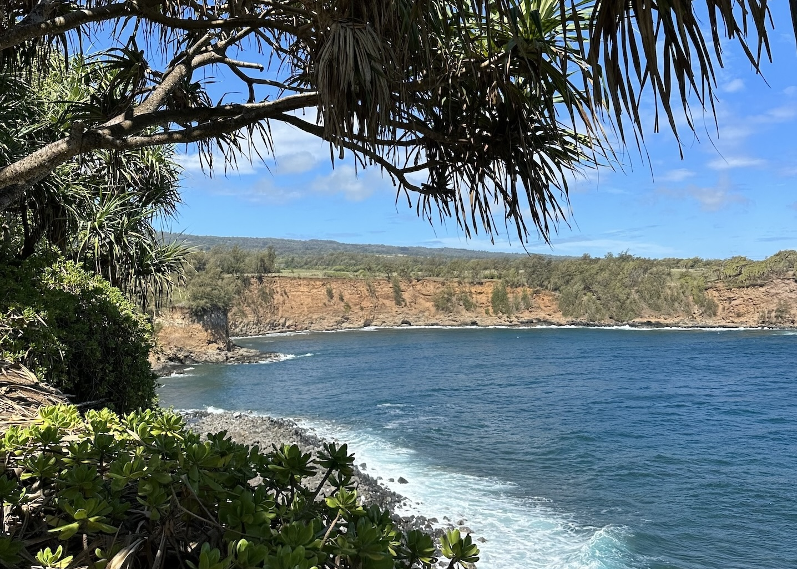
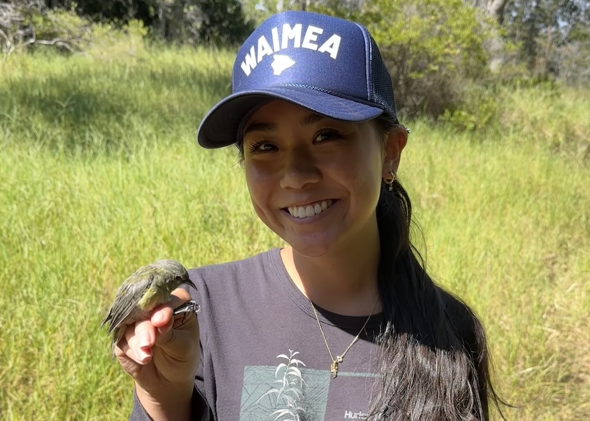
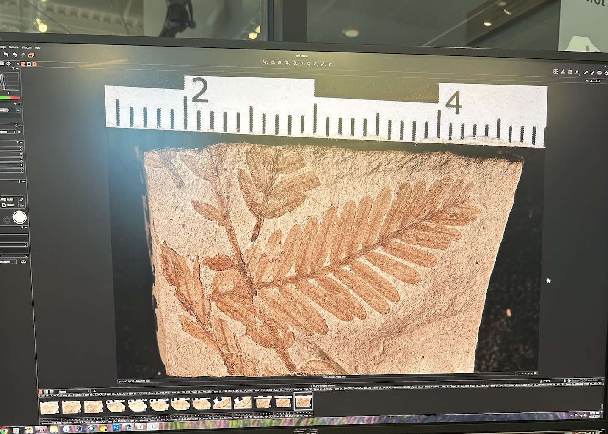
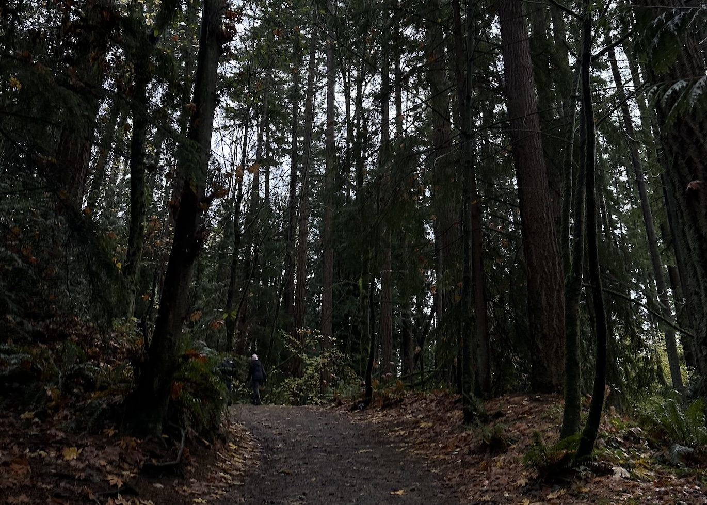
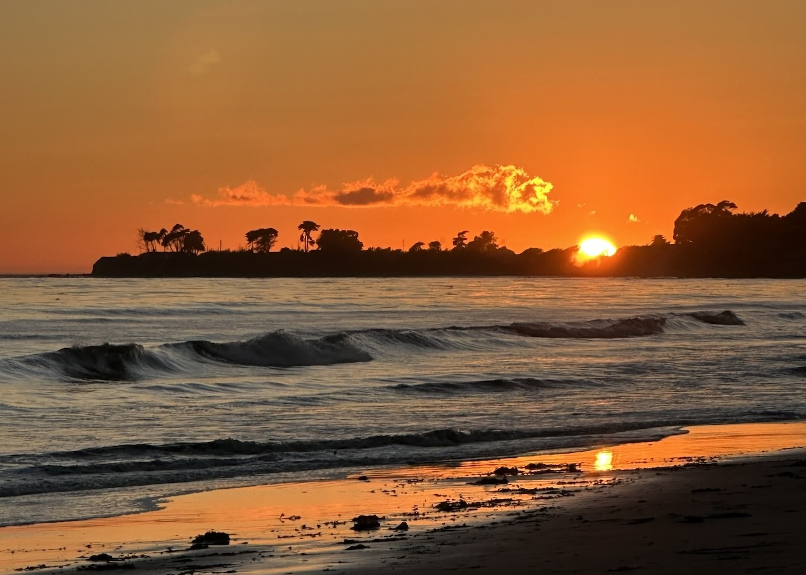

::: {#about-block}
<h1>aloha!</h1>
I am a student in the data science field, inspired by my Hawaiʻi community, where the relationship between the land and people fuels my passion to protect the environment I grew up with, using the intersection of technology and tradition.

I'm interested in conservation, sustainable development, and learning more about traditional ecological knowledge within different communities. My hope is to eventually return back home to Hawaiʻi to give back to my home, but until then I want to explore different places far and wide to learn more about the environment!

When Iʻm not being a Data Scientist, you can find me laying on the beach, trying new foods, cooking/baking, running, or watching the sunset. 

<br>
***Explore my website to learn more about me and the things I do!***
::: 

```{=html}
<style>
.about-entity::after {
  content: "I ka w\0101  ma mua, ka w\0101  ma hope \A (The future is found in the past)";
  display: block;
  text-align: center;
  font-style: italic;
  margin-top: 1rem;
  font-size: 0.9em;
  color: gray;
  white-space: pre;
}
</style>
```
--------------------------------------------------------------------------------

::: {style="text-align: center;"}
#### the inspiration ♡ 
::: {style="width: 80%; margin: 0 auto;"}
::: panel-tabset

### waimea
My home town! The place I will always go back to! Nestled on southern part of the Kohala mountain and made up of unique climates, Waimea is a special place known as paniolo (cowboy) country. I love this image because it truly captures the beauty and meaning of Waimea.
{group="my-group"}

### puakō
Growing up, I spent much time wading in the tide pools with my sister, while my dad dove for fish that we would later eat for dinner! I still love exploring the tide pools here, especially when the sea turtles are basking on the lava rocks.
{group="my-group"}

### mauʻumae
Being a quick 20 minute cruise down the hill, Mauʻumae is my favorite beach on the island of Hawaiʻi.
{group="my-group"}

### nuiliʻi
I spent a day visiting Nuiliʻi in Kohala, an area of land under the care of [The Kohala Center](https://storymaps.arcgis.com/stories/157efdffecaa4271bf124e5dee227629). I was able to tend to the ulu hala (lau hala groves) of Nuiliʻi to contribute to the greater effort of replenishing lau hala in Kohala.
{group="my-group"}

### ʻamakihi
Me and a Hawaiʻi ʻAmakihi! One of my absolute favorite things to do is sitting in an ʻōhiʻa forest and listening to all the native Hawaiian forest bird sing. Since many of these beautiful little birds face many threats such as habitat loss and avian malaria, I feel incredibly lucky to have participated in several bird banding days to gain insights into the health of these populations.

{group="my-group"}

### burke
During my junior year of undergrad, I spent sometime as a Plant Macrofossil Photographer for the Strömberg Paleobotany Lab at the Burke Museum of Natural History and Culture. The museum's glass-walled working labs allowed guests to see curators and scientist in action. While working under the watchful eyes of museum visitors, I was grateful to have the opportunity to show my community what research is like up close.
{group="my-group"}

### seattle
I spent many field trips frolicking in the forests, to escape from the hustle and bustle of the city.

{group="my-group"}

### santa barbara
Where I am now! A place that feels like home, from the sunny weather and beaches to a community that **LOVES** the outdoors.
{group="my-group"}

:::

