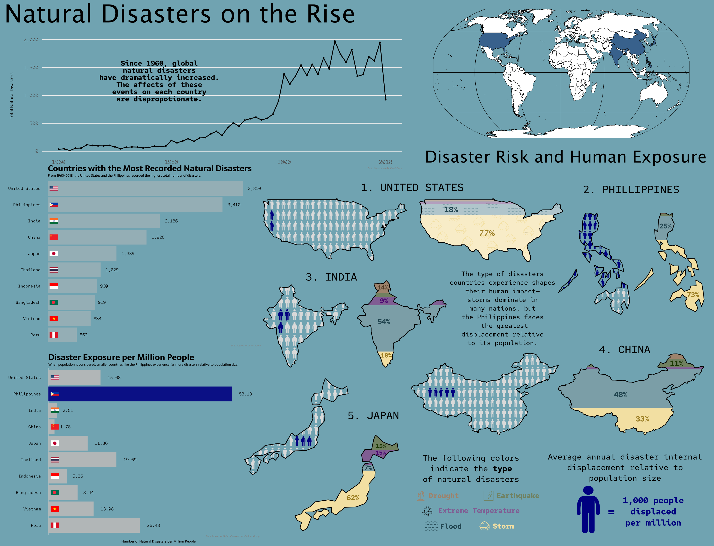
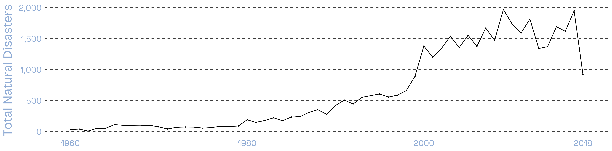
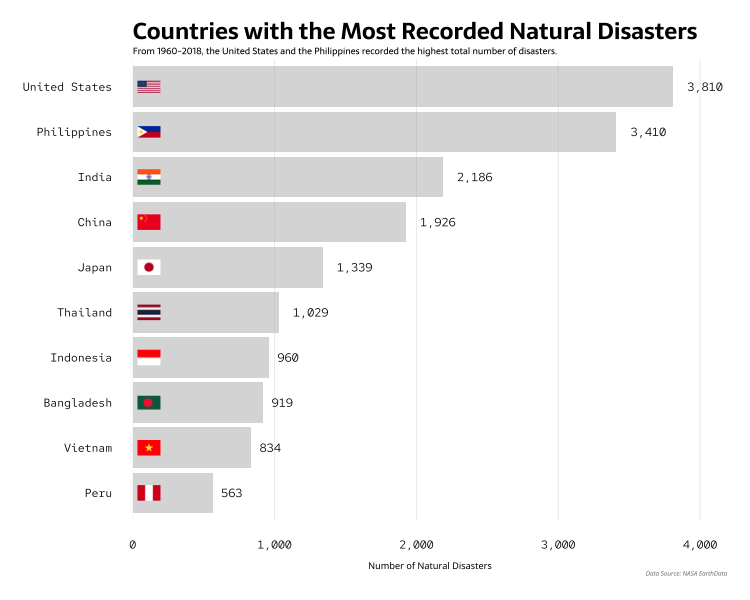
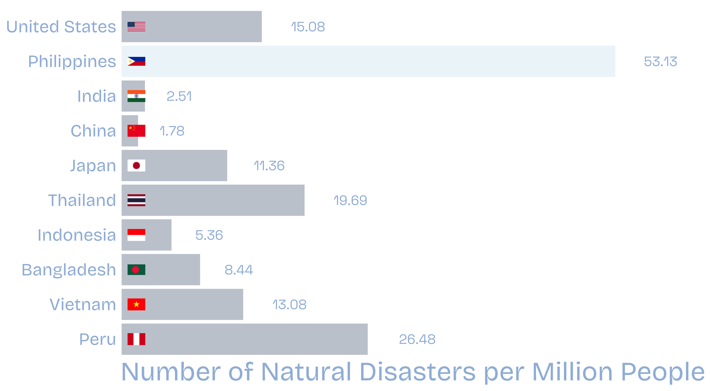
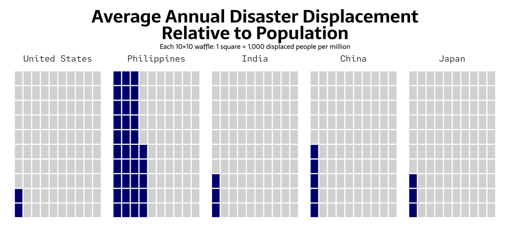
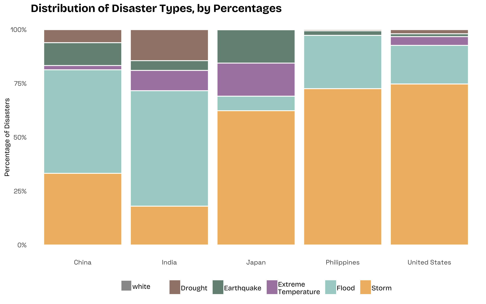

# Background

Natural disasters have major impacts on ecosystems and human populations around the world. Disaster events such as floods, storms, earthquakes, droughts, and extreme temperatures can damage ecosystems, destroy infrastructure, disrupt economies, and displace communities. However, the experience and impacts of disasters across different countries are disproportionate. While geographic location, climate, or environmental conditions can influence the disaster type, social and economic factors also shape the experience of disaster events and how communities are impacted. By examining how patterns of natural disasters types and occurrence impacts different communities we can then understand how these events are distributed globally and how they affect people in unequal ways.

# Infographic

Questions I wanted to answer with my infographic:

**Main question**: How have the types and amount of natural disasters that have occurred around the world between 1960-2018 varied.

**Sub-questions**: 

- Which countries experience the most natural disasters per year around the world? 

- What type natural disasters have occurred the most in different countries? 

- What are the affects of natural disasters on the populations of different countries?

<br>



# The Initial Plots

All initial plots were made in R using `{ggplot}`.

## Total Natural Disaster Trend (1960-2018)

My first plot depicts the trend of annual natural disasters. This is a simple plot that conveys the impactful messages that natural disasters have dramatically increased since 1980.



## Total Natural Disasters by Country

Next, I wanted to determine which countries around the world have the highest total natural disasters. To help the audience identify key points, I also plotted the totals next to the bar charts. This makes it easier for the audience to understand the differences between the countries. By adding the flags to the bar chart, I think this helps the audience identify countries and adds some color to the chart.



## Disaster Events by Population

I then wanted to understand how the different population sizes of each country are affected by natural disasters. Here, I wanted to highlight the fact that smaller countries such as the Philippines experience many more disasters relative to population size. Since the Philippines experiences drastically more disasters relative to population size but is ranked second in the amount of natural disasters they experience, I wanted to highlight this difference. Because, we're again looking at the top ten countries, I wanted to keep the theme of the bar plots similar.



## Population Displaced from Disasters (2008-2018)

I created this waffle chart to understand additional human impacts of natural disasters, specifically the amount of the population internally displaces due to natural disasters. This required taking the average yearly population size and average yearly displacement size. I also did some calculations so that each  square represents 1,000 displaced people per million, which provides a more interpretable scale. To elevate these plots, I used affinity to make each waffle grid the shape of a person.



## Proportion of Natural Disasters by Country

Since the distribution of natural disasters are not uniform across the world, I wanted to visualize the proportion of disaster types for the top five countries. I again used affinity to shape each bar as the county's border. To highlight key points of the stacked bar chart, I also added the associated proportion values within each stack.



# Design Elements

Explore the different design elements I considered while crafting my infographic.

::: panel-tabset
## Graphic Form

**Graphic Form:** I used four different graphical forms for my plots: line plot, bar chart, waffle chart, and stacked bar chart. I wanted to combine simple and alternatives graphical forms into my infographic to communicate information simply, effectively, and interestingly.

## Text

**Text:** I decided to remove much of my plot titles from my infographic and use supporting text and annotations to explain key take aways from my plots. I thought this decision not only de-cluttered my infographic but also allows the audience to focus on the plots.

## Themes

**Themes:** Since my infographic includes many different pieces, I decided to keep my plot themes as minimalistic as possible. This involved removing major and minor gridlines, automated legends, and axis titles.

## Colors

**Colors:** Because my data can point out sensitive trends and patterns, I tried to select a neutral color palette. One that would be representative of natural disasters, rather than colors that were selected for aesthetically pleasing purposes.

## Typography

**Typography:** I chose to use Bricolage Grotesque for the titles, headers, captions, etc. within my infographic. I used Space Grotesk for all numeric text. I decided to use these two fonts because they have an academic feel. To highlight different captions or titles, I used different faces of text, such as regular, medium, bold, and extra bold.

## General Design

**General Design:** The way I wanted to tell the data's story was by starting off big, where I first introduce the yearly global trend of natural disaster totals. Then, I zoom into more specific countries by determining the top 10 countries with the highest total natural disasters. Then, looking more into the type of natural disaster risk and human exposure to natural disasters within the top 5 countries.

## DEI

**Accessibility and DEI:** An aspect I took into consideration when creating my info graphic, was ensuring that color palette was color-blind friendly. A deliberate decision I made was to change the color defining `Extreme Temperature` from red to purple. Since `Extreme Temperature` within my stacked bar chart was plotted next to `Earthquakes` which is colored green, this aspect of my infographic was not colorblind friendly and had to be changed.
:::

# Explore the Code

```{r, eval=FALSE}
#| code-fold: TRUE
#| code-summary: "Code!"
#..............................Set Up.............................

# Load necessary libraries.
library(tidyverse)
library(dplyr)
library(paletteer)
library(lubridate)
library(showtext)
library(sysfonts)
library(stringr)
library(ggstream)
library(cowplot)
library(ggplot2)
library(rnaturalearth)
library(sf)
library(ggimage)
library(countrycode)
library(janitor)
library(gghighlight)
library(ARTofR)
library(waffle)

##~~~~~~~~~~~~~~~~~~~~~~~~~~~~~~~~~~~~~~~~~~~~~~~~~~~~~~~~~~~~~~~~~~~~~~~~~~~~~~
##                                  Load Data                               ----
##~~~~~~~~~~~~~~~~~~~~~~~~~~~~~~~~~~~~~~~~~~~~~~~~~~~~~~~~~~~~~~~~~~~~~~~~~~~~~~

# Read in natural disaster world data.
nat_dis <- read_csv(here::here("posts",
                               "eds240-blog-post",
                               "data", 
                               "pend-gdis-1960-2018-disasterlocations-csv", 
                               "pend-gdis-1960-2018-disasterlocations.csv")) %>%
  mutate(year = as.integer(year)) %>% 
  filter(disastertype %in% c("earthquake", 
                             "flood", 
                             "storm", 
                             "drought", 
                             "extreme temperature"))

# Read in population data.
pop <- read_csv(here::here("posts",
                           "eds240-blog-post",
                           "data", 
                           "world_population", 
                           "population.csv"), 
                skip = 4, 
                show_col_types = FALSE) %>% 
  select(where(~ !all(is.na(.))))

# Read in displaced data (2008 -2018)
displaced <- read_csv(here::here("posts",
                                 "eds240-blog-post",
                                 "data", 
                                 "internally-displaced-persons-from-disasters",
                                 "internally-displaced-persons-from-disasters.csv")) %>% 
  rename("displaced" = "Internally displaced persons, new displacement associated with disasters (number of cases)")

#.................Select Fonts and Color Palette.................

# Add special fonts
font_add_google(name = "Space Grotesk", family = "sans-serif") # axis details and numbers
font_add_google(name = "Bricolage Grotesque", family = "bricolage") # titles, captions

# Define infographic colors.
"grey_blue" <- "#8896A7" # bar colors
"pale_blue" <- "#A1BBDD" # text colors
"dark_grey" <- "#4D4D4D" # plot background details

# Create color palette for disaster type.
pal <- c("drought" = "#663317",
         "earthquake" = "#0B4A32",
         "extreme temperature" = "#783682",
         "flood" = "#75B9B0",
         "storm" = "#E89300")
##~~~~~~~~~~~~~~~~~~~~~~~~~~~~~~~~~~~~~~~~~~~~~~~~~~~~~~~~~~~~~~~~~~~~~~~~~~~~~~
##                  Total Natural Disaster Trend (1960-2018)                ----
##~~~~~~~~~~~~~~~~~~~~~~~~~~~~~~~~~~~~~~~~~~~~~~~~~~~~~~~~~~~~~~~~~~~~~~~~~~~~~~

#.........................Summarize Data.........................

# Create the `yearly_total` dataframe.
yearly_total <- nat_dis %>% 
  # Get the total number of disasters per year.
  count(year, name = "total_disasters")

#............................Line Plot...........................

showtext.auto(enable = TRUE)

# Create a line graph.
line_trend <- ggplot(data = yearly_total, aes(x = year, y = total_disasters)) +
  geom_line() +
  geom_point(size = 0.4) +
  scale_x_continuous(limits = c(1960, 2018),
                     breaks = c(seq(1960, 2015, by = 20), 2018)) +
  scale_y_continuous(labels = scales::label_comma()) +
  labs(y = "Total Natural Disasters",
       ) +
  theme_minimal(base_size = 17) +
  # Theme adjustments.
  theme(
    axis.text = element_text(family = "sans-serif",
                             color = pale_blue),
    axis.text.y = element_text(size = rel(1.5), 
                               color = pale_blue),
    axis.text.x = element_text(size = rel(1.5),
                               color = pale_blue),
    axis.title.x = element_blank(),
    axis.title.y = element_text(family = "bricolage",
                                size = rel(1.8), 
                                margin = margin(t = 15,
                                                r = 12),
                                color = pale_blue),
    panel.grid.minor.x = element_blank(),
    panel.grid.minor.y = element_blank(),
    panel.grid.major.x = element_blank(),
    panel.grid.major.y = element_line(linetype = "dashed", 
                                      color = dark_grey),
    panel.background = element_rect(fill = "transparent", color = NA),
    plot.background  = element_rect(fill = "transparent", color = NA))

##~~~~~~~~~~~~~~~~~~~~~~~~~~~~~~~~~~~~~~~~~~~~~~~~~~~~~~~~~~~~~~~~~~~~~~~~~~~~~~
##                     Total Natural Disasters by Country                   ----
##~~~~~~~~~~~~~~~~~~~~~~~~~~~~~~~~~~~~~~~~~~~~~~~~~~~~~~~~~~~~~~~~~~~~~~~~~~~~~~

#.........................Summarize Data.........................

# Create the `top_10` dataframe.
top10_df <- nat_dis %>% 
  # Get the yearly totals for each country.
  count(country, year, name = "disaster_count") %>% 
  # Calculate the total of all events between 1960-2018.
  group_by(country) %>% 
  summarize(country_sum = sum(disaster_count), 
            .groups = "drop") %>%  
  # Select the top 10 countries.
  slice_max(country_sum, n = 10) %>%    
  # Add flag image source as a new column.
  mutate(iso2 = countrycode(country, 
                            origin = "country.name", 
                            destination = "iso2c"),
         flag = paste0("https://flagcdn.com/w40/", tolower(iso2), ".png"),
         country = fct_reorder(country, country_sum))

#............................Bar Plot............................

showtext.auto(enable = TRUE)

# Create a bar chart.
top10 <- ggplot(top10_df, aes(x = country_sum, y = country)) +
  geom_col(fill = grey_blue,
           alpha = 0.5) +
  # Add the total value to the end of the bar.
  geom_text(aes(label = scales::comma(country_sum)),
            hjust = -0.4, 
            color = pale_blue,
            size = 7,
            family = "sans-serif") +
  # Add flag images to associated country.
  geom_image(aes(image = flag),
             x = max(top10_df$country_sum) * 0.03,
             size = 0.05,
             by = "width") +
  # Expand the x-axis for for flag and total value placement.
  scale_x_continuous(labels = scales::label_comma(),
                     expand = expansion(mult = c(0, 0.1))) +
  labs(x = "Number of Natural Disasters",) +
  theme_minimal(base_size = 17) +
  # Theme adjustments.
  theme(
    axis.text = element_text(family = "bricolage",
                             size = rel(1.5),
                             color = pale_blue),
    axis.text.y = element_text(size = rel(1),
                               color = pale_blue),
    axis.text.x = element_blank(),
    axis.title.x = element_text(family = "bricolage",
                                size = rel(2.5),
                                color = pale_blue),
    axis.title.y = element_blank(),
    panel.grid = element_blank(),
    panel.grid.major.y = element_blank(),
    panel.grid.minor.x = element_blank(),
    panel.background = element_rect(fill = "transparent", color = NA),
    plot.background  = element_rect(fill = "transparent", color = NA))

##~~~~~~~~~~~~~~~~~~~~~~~~~~~~~~~~~~~~~~~~~~~~~~~~~~~~~~~~~~~~~~~~~~~~~~~~~~~~~~
##                        Disaster Events by Population                     ----
##~~~~~~~~~~~~~~~~~~~~~~~~~~~~~~~~~~~~~~~~~~~~~~~~~~~~~~~~~~~~~~~~~~~~~~~~~~~~~~

#.........................Summarize Data.........................

# Create top 10 country list from referencing `top_10` bar plot.
top10_list <- c("United States", 
                "Philippines", 
                "India", 
                "China", 
                "Japan", 
                "Thailand", 
                "Indonesia", 
                "Bangladesh", 
                "Vietnam", 
                "Peru")

# Create `pop_avg_top10` dataframe.
pop_avg_top10 <- pop_long %>% 
  # Filter data by the designated time frame and countries of interest.
  filter(year >= 1960, year <= 2018) %>% 
  filter(country_name %in% top10_list) %>% 
  # Calculate the average population for each country.
  group_by(country_name) %>% 
  summarise(avg_population = mean(population, na.rm = TRUE), .groups = "drop")

# Create `disaster_percap` dataframe.
disaster_percap <- top10_df %>% 
  # Join population average dataframe to disaster totals by country dataframe.
  left_join(pop_avg_top10, by = c("country" = "country_name")) %>% 
  # Calculate the amount of disasters per million people in each country.
  mutate(dis_per_million = country_sum / avg_population * 1e6) %>% 
  # Add flag image source as a new column.
  mutate(iso2 = countrycode(country, origin = "country.name", destination = "iso2c"),
         flag = paste0("https://flagcdn.com/w40/", tolower(iso2), ".png"),
         country = fct_reorder(country, country_sum))

#............................Bar Plot............................

# Create a bar chart.
pop_bar <- ggplot(disaster_percap, aes(x = dis_per_million, y = country)) +
  # Fill by the conditional statement to highlight the Philippines.
  geom_col(aes(fill = country == "Philippines"), alpha = 0.5) +
  # Add the total value to the end of the bar.
  geom_text(
    aes(label = scales::comma(dis_per_million)),
    hjust = -0.85,
    color = pale_blue,
    size = 7,
    family = "sans-serif") +
  # Add flag images to associated country.
  geom_image(aes(image = flag), x = max(disaster_percap$dis_per_million) * 0.03,
             size = 0.05,
             by = "width") +
  # Bars are colored by true/false statements with designated colors.
  scale_fill_manual(
    values = c("TRUE" = "#DFEDF6", "FALSE" = grey_blue),
    guide = "none")  +
  # Expand the x-axis for for flag and total value placement.
  scale_x_continuous(labels = scales::label_comma(),
                   expand = expansion(mult = c(0, 0.18))) +
  labs(x = "Number of Natural Disasters per Million People") +
  theme_minimal(base_size = 17) +
  # Theme adjustments.
  theme(
    axis.text = element_text(family = "sans-serif",
                             size = rel(1.5)),
    axis.title.x = element_text(family = "bricolage",
                                size = rel(2.3), 
                                color = pale_blue),
    axis.title.y = element_blank(),
    axis.text.x = element_blank(),
    axis.text.y = element_text(size = rel(1),
                               margin = margin(r = -0.5),
                               family = "bricolage",
                               color = pale_blue),
    panel.grid = element_blank(),
    panel.grid.major.y = element_blank(),
    legend.position = "none",
    panel.background = element_rect(fill = "transparent", color = NA),
    plot.background  = element_rect(fill = "transparent", color = NA))

##~~~~~~~~~~~~~~~~~~~~~~~~~~~~~~~~~~~~~~~~~~~~~~~~~~~~~~~~~~~~~~~~~~~~~~~~~~~~~~
##              Population Displaced from Disasters (2008-2018)             ----
##~~~~~~~~~~~~~~~~~~~~~~~~~~~~~~~~~~~~~~~~~~~~~~~~~~~~~~~~~~~~~~~~~~~~~~~~~~~~~~

#.........................Summarize Data.........................

# Create top 5 country list from referencing `top_10` bar plot.
top5_list <- c("United States", "Philippines", "India", "China", "Japan")

# Create a `displaced_top5` dataframe.
displaced_top5 <- displaced %>%
  # Filter data by the designated time frame (2008-2018) and countries of interest.
  filter(Entity %in% top5_list,
         Year >= 2008, Year <= 2018) %>%
  # Calculate the average amount of people displaced by country.
  group_by(Entity) %>%
  summarise(avg_displaced = mean(displaced, na.rm = TRUE), .groups = "drop")

# Create a `pop_top5` dataframe.
pop_avg_top5 <- pop_avg_top10 %>% 
  # Filter data by countries of interest.
  filter(country_name %in% top5_list)

# Create a `displaced_pop` dataframe.
displaced_pop <- displaced_top5 %>%
  # Join displaced dataframe to population average dataframe.
  left_join(pop_avg_top5, by = c("Entity" = "country_name")) %>%
  # Calculate the amount of people displaced per million people.
  mutate(displaced_per_million = avg_displaced / avg_population * 1e6,
  # Divide by 1000 so that 1 square represents ~1000 displaced people per million.
  # Cap the value at 100 so it fits in a 10x10 waffle grid.
         displaced_sq = pmin(100, round(displaced_per_million / 1000)),
  # Calculate people not displaced.
         not_displaced_sq = 100 - displaced_sq) %>%
  # Select columns needed for waffle plot.
  select(Entity, displaced_sq, not_displaced_sq) %>%
  # Make data long.
  pivot_longer(
    cols = c(displaced_sq, not_displaced_sq),
    names_to = "group",
    values_to = "n") %>%
  # Rename category levels.
  mutate(group = recode(group,
                        displaced_sq = "Displaced",
                        not_displaced_sq = "Not displaced"))

#..........................Waffle Plot...........................

# Create waffle chart.
waffle <- ggplot(displaced_pop, aes(fill = group, values = n)) +
  geom_waffle(n_rows = 10,
              size = 0.1,
              color = "white") +
  # Create a waffle chart for each country.
  facet_wrap(~ Entity, ncol = 5) +
  # Set displacement colors.
  scale_fill_manual(values = c("Displaced" = "navy",
                               "Not displaced" = "grey85")) +
  labs(
    subtitle = "Each 10×10 waffle:\n1 square ≈ 1,000 displaced people per million",
    fill = NULL) +
  theme_minimal() +
  # Theme adjustments.
  theme(
    plot.subtitle = ggtext::element_markdown(family = "bricolage",
                                             lineheight = .5,
                                             size = rel(1),
                                             margin = margin(b = 1),
                                             hjust = 0.5),
    plot.margin = margin(t = 2, r = 2, b = 2, l = 2),
    panel.spacing = unit(0.1, "lines"),
    panel.grid = element_blank(),
    axis.text = element_blank(),
    axis.title = element_blank(),
    axis.ticks = element_blank(),
    strip.text = element_text(family = "bricolage",
                              size = rel(2),
                              margin = margin(b = .5,
                                              t = 1)),
    legend.position = "none",
    panel.background = element_rect(fill = "transparent", color = NA),
    plot.background  = element_rect(fill = "transparent", color = NA))

##~~~~~~~~~~~~~~~~~~~~~~~~~~~~~~~~~~~~~~~~~~~~~~~~~~~~~~~~~~~~~~~~~~~~~~~~~~~~~~
##                 Proportion of Natural Disasters by Country               ----
##~~~~~~~~~~~~~~~~~~~~~~~~~~~~~~~~~~~~~~~~~~~~~~~~~~~~~~~~~~~~~~~~~~~~~~~~~~~~~~

#.........................Summarize Data.........................
# Create top 5 country list from referencing `top_10` bar plot.
top5_countries <- c("United States", "Philippines", "India", "China", "Japan")

# Create a `type_country` dataframe.
type_country <- nat_dis %>% 
  filter(country %in% top5_countries) %>% 
  # Calculate the proportion of types of disaster for each country.
  group_by(country, disastertype) %>% 
  summarise(disastertype_count = n(), 
            .groups = "drop")

#........................Stacked Bar Plot........................

# Create a stacked bar chart.
stacked_bar <- ggplot(data = type_country, aes(x = country, y = disastertype_count, fill = disastertype, color = "white")) +
  geom_col(position = "fill", alpha = 0.65) +
  # Color disaster type by designated palette.
  scale_fill_manual(values = pal,
                    labels = c("drought" = "Drought",
                               "earthquake" = "Earthquake",
                               "extreme temperature" = "Extreme\nTemperature",
                               "flood" = "Flood",
                               "storm" = "Storm")) +
  scale_color_manual(values = "white")+
  # Make y-axis labels appear as percents.
  scale_y_continuous(labels = scales::label_percent(scale = 100)) +
  labs(x = "Country",
       y = "Percentage of Disasters",
       title = "Distribution of Disaster Types, by Percentages",
       fill = "Disaster Type") +
  theme_minimal() +
  # Theme adjustments.
  theme(
    plot.title = ggtext::element_markdown(family = "bricolage",
                                          face = "bold",
                                          lineheight = 1.2),
    axis.text = element_text(family = "sans-serif",
                             size = rel(0.7)),
    axis.title.x = element_blank(),
    axis.title.y = element_text(family = "bricolage",
                                size = rel(0.75), 
                                margin = margin(t = 15)),
    legend.position = "bottom",
    legend.title.position = "bottom",
    legend.direction = "horizontal",
    legend.text = element_text(family = "bricolage",
                                size = rel(0.75), 
                                margin = margin(t = 2)),
    legend.title = element_blank(),
    legend.key.width = unit(0.5, "cm"),
    legend.key.height = unit(0.5, "cm"),
    panel.grid = element_blank())
```

# Data Citation

Internal Displacement Monitoring Centre (IDMC). Internally displaced persons, new displacement associated with disasters (number of cases) \[WB_WDI\]. World Bank Group: World Development Indicators. <https://data.worldbank.org/indicator/VC.IDP.NWDS> Date Accessed: 2026-02-25

Rosvold, E., & Buhaug, H. (2021). Geocoded Disasters (GDIS) Dataset (Version 1.00) \[Data set\]. Palisades, NY: NASA Socioeconomic Data and Applications Center (SEDAC). <https://doi.org/10.7927/ZZ3B-8Y61> Date Accessed: 2026-02-19

World Population Prospects, United Nations (UN), et. al. Population, total \[WB_WDI\]. World Bank Group: World Development Indicators. <https://data.worldbank.org/indicator/SP.POP.TOTL> Date Accessed: 2026-02-25
