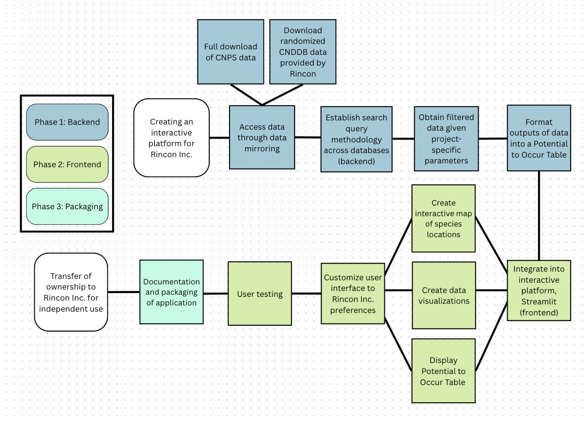

# Engineering a Data Processing Application for an Environmental Consulting Company

### The Overarching Problem

California’s diverse ecosystems are under increasing pressure from multiple environmental and human-inflicted challenges. Some of these challenges include urban development, habitat fragmentation, and accelerating climate change. Urban development is expanding into natural landscapes, Habitat fragmentation disrupts ecosystem connectivity, and accelerating climate change alters environmental conditions at an unprecedented rate. These pressures are affecting California's ecosystems and creating new challenges for biodiversity conservation and sustainable development.

These environmental challenges directly impact California's wildlife species and sensitive habitats. Driving shifts in species distributions and increase the vulnerability of already at-risk plants and wildlife. This makes it critical to better understand how development and environmental change affect ecological systems.

# About Rincon Consultants Inc. 

As a California-based environmental consulting firm, Rincon helps public and private sector projects navigate the balance between development and stewardship. Specifically, through Rincon’s Biological Resources Team, biologists conduct evaluations to assess potential impacts on species and habitats. These evaluations involve identifying species presence, occurrence patterns, and habitat locations within a project area.

# The Data Science Need

To conduct project evaluations, biologists access several different biological datasets and go through time-consuming and manual data processing. This includes downloading separate files from different websites, cross-validation, data cleaning (standardizing, merging, filtering, etc.), retrieving spatial information from a GIS team, and producing analysis tools. The workflow involves many different steps across multiple tools, datasets, and teams. It is manual and not consistent, meaning a biologist may approach the process differently depending on their own methods and experience. Therefore, the gap within Rincon’s biological evaluation process was the lack of a centralized system to streamline and standardize the work.

**Our goal** was to provide Rincon Consultants with a scalable and efficient system that allows biologists to spend less time managing data and more time focused on ecological interpretation and environmental decision-making.

To achieve this, we defined three deliverables:

1. Establish a reproducible data processing workflow that helps automate data integration while improving data retrieval consistency across projects.

2. Design an interactive, user-friendly application designed to simplify and standardize project data processing.

3. Maintain a detailed and packaged code repository that allows for future expansion and adaptation of the tool over time.

# The Approach

Our approach was broken down into three main parts: 1) backend development, 2) frontend development, 3) packaging.

This approach allowed us to perfect the replication of a reproducible and standardized data processing workflow that could be easily applied to projects of different scales and needs. Once the workflow was completed, we were able to integrate the workflow into a more user-friendly experience using the application builder Streamlit. This framework allowed for specific gadgets and customization needs, requested by Rincon, such as uploading files, mapping large-scale projects, creating editable tables, and exporting tables to a formatted Microsoft Word report document.

# The Bio Weaver Tool









*Note: For demonstration and security of classified information purposes, all data has been randomized and is not accurate.*

# Next Steps

This version of the Bio Weaver Tool provides Rincon with an initial fully functional tool that can be used every day in the workplace. However, this version is also foundational, and along with the application, Rincon also received much documentation/instructions to further build and expand the tool. One potential next step would be to incorporate additional biological data sources used in the tool. Another possibility is for them to extend map interactivity and details, such as the incorporation of various mapping features (elevation, soils, etc.). For the long term, Rincon could also integrate benchmark capabilities within the dashboard to allow for multi-project comparison over time.

Overall, our project goes beyond just a simple dashboard tool. It is clear that there is a growing need for environmental consulting workflows to become more scalable, more consistent, and more accessible, especially as biological data and projects become more complex. The Bio Weaver is just one example we have set of how we can use integrated data tools to move workflows in that direction. 

# My Experience

This project was incredibly unique, where my team had the opportunity to work with a real-world client to create a tool that would be used in a workplace every day. I learned so much about the technicalities behind software/application development. This was a great experience to gain, as this project exposed me to different methods, concepts, processes, frameworks, and vocabulary that I had not ever heard of six months ago. While we faced many challenges throughout our project, I'm grateful to have worked with amazing team members, advisors, and clients who were attentive, flexible, and committed to the project throughout its entirety. This project gave me the hands-on experience to create a data tool used for real-world decision-making, and has inspired me to continue using technology and data to support these decisions.

# Acknowledgements

We extend our gratitude to our team at Rincon Consults Inc., Lisa Achter, Carly Caswell, Robin Murray, Allie Sennett, Tyler Friesen, Dr. Kelly Caylor, Dr. Carmen Galaz García, the MEDS Capstone Committee, and our MEDS cohort for their support, feedback, and love throughout the year.

